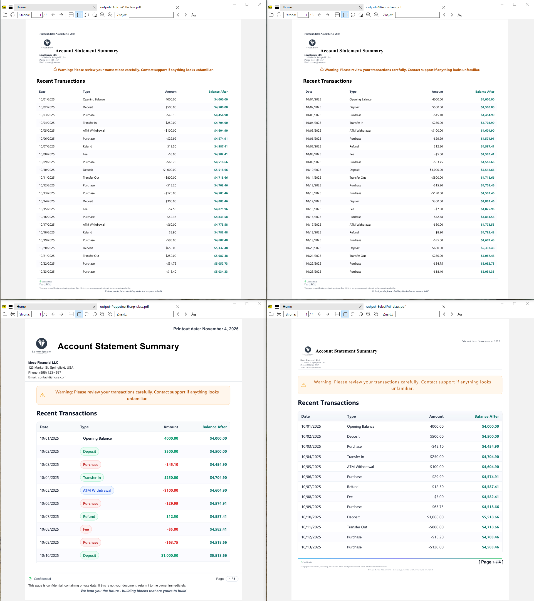
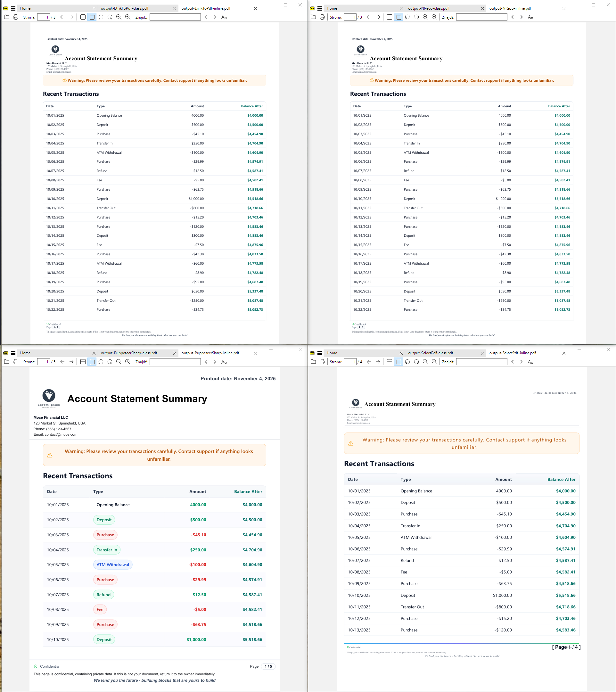

# PDF Generation in .NET — Technical Evaluation and Go/No‑Go (Nov 2025)

This document evaluates four approaches to HTML→PDF in .NET and provides a clear Go/No‑Go decision for each, including containerization/server caveats and a recommended solution.

## Contents
- Scope and goals
- Evaluation criteria
- Executive summary (Go/No‑Go)
- Detailed findings by approach
  - PuppeteerSharp (Chromium)
  - NReco (wkhtmltopdf wrapper)
  - DinkToPdf (wkhtmltopdf wrapper)
  - SelectPdf (proprietary engine)
- Cross‑cutting caveats and mitigations
- Suggested solution ⇒ PuppeteerSharp
- Performance snapshot
- Appendix: Feature comparison
- How to run locally

---

# Scope and goals

- Goal: Generate multi‑page PDFs from standardized HTML (header, footer with page X/Y, multi‑page body with tables and text).
- Constraints: Production‑friendly, portable across environments, predictable rendering, and minimal operational friction where feasible.
- What we compare: Rendering fidelity, setup complexity, portability (Linux containers/servers), caveats, licensing, performance.

---

# Evaluation criteria

- Rendering fidelity for modern HTML5/CSS3 and JavaScript
- Operational setup (native dependencies, downloads, image size, cold start)
- Linux container compatibility (dependencies, sandbox, /dev/shm, fonts)
- Server/headless suitability and concurrency patterns
- Licensing and ongoing maintenance
- Known quirks and mitigations

---

# HTML-to-PDF Libraries Overview

This section provides a quick reference of all HTML-to-PDF libraries evaluated in this repository.

## Tested Libraries

- **PuppeteerSharp** — Chromium-based headless browser; excellent modern CSS/JS support and rendering fidelity - maintained
- **NReco.PdfGenerator** — Managed wrapper around wkhtmltopdf; good for static layouts with minimal setup - not maintained 2 years
- **DinkToPdf** — Community wkhtmltopdf wrapper; requires native library management per OS/architecture - not maintained 8 years
- **SelectPdf** — Commercial HTML converter with proprietary engine; managed-only, good fidelity but slower JS execution - maintained - 5 months w/o update
- **IronPDF** — Commercial Chromium-based converter; managed .NET library with high-fidelity rendering and US Letter support - maintained - 1 month w/o update
- **Spire.PDF** - Modern fluent API for PDF generation; tested but NO GO due to poor HTML sytnax support - maintaned
- **Syncfusion.HtmlToPdfConverter** — Commercial Blink-based converter; comprehensive .NET PDF library with modern HTML5/CSS3 support - maintained

## Not Tested

- **QuestPDF** — Modern fluent API for PDF generation; not tested due to lack of HTML input support (code-first approach only)

---

# Executive summary (Go/No‑Go)

- PuppeteerSharp (Chromium): GO — Recommended
  - Best fidelity; common in server/headless use; predictable results. Requires Chromium + OS libs, some container tuning. Heavier image and RAM than wkhtmltopdf.
- NReco (wkhtmltopdf wrapper): CONDITIONAL GO
  - Go for simpler/static layouts and teams that prefer minimal native work, with awareness of older engine limits. Validate Linux container story (wkhtmltopdf availability and licensing) before production.
- DinkToPdf (wkhtmltopdf wrapper): NO‑GO (for Linux containers without extra native management)
  - Requires correct native libwkhtmltox per OS/arch and careful packaging. Works on Windows as provided here, but increases container friction.
- SelectPdf (proprietary): GO (Licensed) / NO‑GO (Community)
  - Operationally simple (managed‑only dependencies) and good fidelity, but Community Edition is limited to 5 pages. Requires commercial license for production; note JS execution performance characteristics.
- Spire.Pdf: NO‑GO (uncapable of proper header / footer managing from HTML syntax)
  - To support mentioned it should start with c# object approach

## Quick status matrix

| Project        | Rendering fidelity                         | Linux/container portability                                   | Server/headless suitability                    | Performance (relative, this repo)                                                | Licensing / limits                                          | Overall decision                               |
|----------------|--------------------------------------------|----------------------------------------------------------------|-----------------------------------------------|----------------------------------------------------------------------------------|--------------------------------------------------------------|-----------------------------------------------|
| PuppeteerSharp | ✅ Excellent; closest to real Chrome        | ✅ Common in Debian/Ubuntu images (Chromium + fonts required)  | ✅ Designed for headless/browser automation     | ⚠️ Very fast for tens of PDFs; slower than wkhtmltopdf in 100× tests; ~90 MB RAM | ✅ MIT; you own Chromium/image patching                         | ✅ GO — Recommended default                   |
| NReco          | ⚠️ Good for static layouts; older WebKit    | ⚠️ Depends on wkhtmltopdf being available in the image        | ✅ Fine for static HTML → PDF                  | ✅ Among fastest; consistently lowest RAM (≈20–30 MB)                             | ⚠️ Commercial; verify wkhtmltopdf licensing                    | ⚠️ CONDITIONAL GO — simple/static layouts     |
| DinkToPdf      | ⚠️ Same as NReco (wkhtmltopdf)             | ❌ Brittle; manual native libwkhtmltox per OS/arch             | ✅ Works for static HTML                       | ✅ Fastest or tied-fastest in synthetic runs; higher RAM (≈55–65 MB)             | ✅ MIT wrapper + LGPLv3 engine                                 | ❌ NO‑GO — native packaging friction          |
| SelectPdf      | ✅ Very good; close to Chromium             | ✅ Managed-only; straightforward in containers                 | ✅ Good, but JS execution is slower            | ❌ Slowest overall; highest memory usage                                         | ⚠️ Community: 5‑page limit; commercial license needed for prod | ⚠️ GO (Licensed) / ❌ NO‑GO (Community CE)    |
| IronPDF        | ✅ Chromium-based; high fidelity            | ⚠️ Managed library but bundles Chromium bits; larger image     | ✅ Built for server-side use                   | ⚠️ Slower than PuppeteerSharp; very high RAM in load tests                        | ⚠️ Commercial license required                                  | ⚠️ CONDITIONAL GO — niche, license-heavy      |
| Syncfusion     | ✅ Modern HTML5/CSS3 (Blink-based engine)   | ⚠️ Native Blink deps; container story similar to Chromium     | ✅ Server/enterprise-focused                   | ⚠️ Fastest in “100 PDFs at once”; slower in small runs; high RAM                 | ⚠️ Commercial; community license only for some users           | ⚠️ CONDITIONAL GO — strong but heavy/paid     |
| Spire.Pdf      | ❌ Poor HTML + header/footer support        | ⚠️ Works technically; HTML engine is the blocker              | ⚠️ Usable as generic PDF API only             | ⚠️ Middle of the pack for speed; moderate RAM                                     | ⚠️ Commercial for full use                                     | ❌ NO‑GO for HTML→PDF; PDF API only          |


Legend: ✅ good/yes • ⚠️ conditional/has caveats • ❌ no-go

---

# PuppeteerSharp (Chromium) — GO (Recommended)
## What
- .NET client for headless Chromium. Produces output closest to a real Chrome browser.

## Rendering fidelity
- Excellent modern CSS/JS support; print CSS works as expected; headers/footers supported via templates.

## Linux container compatibility
- Yes, widely used in Debian/Ubuntu‑based containers. Avoid Alpine unless you manage musl‑linked dependencies yourself.
- Your current code already runs headless and includes `--no-sandbox`. For best security, run as a non‑root user and drop `--no-sandbox`.

## Server/headless suitability
- Yes. Designed for headless. Common in CI and server contexts.
- Reuse a single Browser instance; open/close Pages per job. Pre‑warm on startup to avoid cold start.

## Known limitations/caveats
- Larger footprint and cold starts than wkhtmltopdf; Chromium is heavy (~100–150 MB).
- Memory usage can be higher; concurrency needs capping to avoid OOM.
- Revision pinning: PuppeteerSharp expects a compatible Chromium revision.
- Fonts/locales must be installed or embedded for correct glyph coverage (e.g., CJK).
- Security updates for Chromium are your responsibility in custom images.

## Operational guidance (servers/CI)
- Concurrency: 1 Browser per process; reuse Pages. Limit concurrent pages to avoid memory spikes.
- Warm‑up: Start Browser at service startup.
- Timeouts: Use SetContentAsync with DOMContentLoaded (as in this repo) for deterministic readiness.
- Observability: Capture Chromium stderr (DumpIO/Pipe). Watch for: "no usable sandbox", "no space left on device", OOM kills.
- Fonts: Install/ship required fonts. For brand typography, add specific TTF/OTF packages.

## Decision: GO — Recommended for production with the container/server guidance above.

---

# NReco (wkhtmltopdf wrapper) — CONDITIONAL GO

## What
- .NET wrapper around wkhtmltopdf (older WebKit‑based engine).

## Rendering fidelity
- Good for static content, but weaker modern CSS/JS support (complex grid/flex, advanced selectors) vs Chromium.

## Operational setup
- API is simple ("managed‑only" from consumer perspective), but actual portability depends on the availability of wkhtmltopdf binaries for the target OS/arch.
- Validate Linux container runtime: ensure the appropriate wkhtmltopdf binary is available and compatible with your base image.

## Linux container compatibility
- Possible, but confirm packaging: either install wkhtmltopdf in the image or use an NReco distribution that includes Linux binaries. Fonts must be present.
- Simpler than managing Chromium, but you inherit wkhtmltopdf engine limitations.

## Server/headless suitability
- Yes for static HTML → PDF scenarios; tends to be fast and lightweight.

## Known limitations/caveats
- Older engine; gaps in modern CSS/JS. Complex print layouts may diverge from Chrome output.
- Vendor licensing; verify costs and distribution terms for your deployment model.

## Decision: CONDITIONAL GO — Acceptable for simpler/static layouts or when operational minimalism is paramount. Not recommended if you require modern CSS/JS parity with Chrome.

---

# DinkToPdf (wkhtmltopdf wrapper) — NO‑GO (for containerized Linux without extra native care)

## What
- Community wrapper for wkhtmltopdf requiring native libwkhtmltox.

## Rendering fidelity
- Same engine as NReco (wkhtmltopdf). Good for basic layouts; limited modern CSS/JS.

## Operational setup
- Requires correct native library (matching OS/arch). This repo ships Windows DLLs; container images need Linux libs.
- Extra friction to package and maintain native dependencies across environments.

## Linux container compatibility
- Achievable but brittle. You must install libwkhtmltox with compatible glibc versions and ensure font availability.

## Server/headless suitability
- Yes for static HTML; faster startup than Chromium.

## Known limitations/caveats
- Low community activity, native dependency management overhead, and same engine limitations as above.

## Decision: NO‑GO — Prefer NReco if you want wkhtmltopdf semantics with less native packaging hassle; prefer PuppeteerSharp if you need fidelity.

---

# SelectPdf (proprietary engine) — GO (Licensed) / NO‑GO (Community)

## What
- Commercial engine with broad HTML5/CSS3 feature coverage and simple API.

## Rendering fidelity
- Excellent overall; often close to Chromium for many layouts.

## Operational setup
- Managed‑only dependency model (no system Chromium), which simplifies containers.
- Community Edition limit: 5 pages per document.

## Linux container compatibility
- Yes (managed‑only makes it straightforward). Fonts still need to be installed for coverage.

## Server/headless suitability
- Yes. Note that JavaScript execution can be significantly slower than modern browsers.
  - In this repo we preprocess transaction rows server‑side (apply classes/wrap badges) and remove inline JS, then set `JavaScriptEnabled = false` to avoid long runtimes.

## Known limitations/caveats
- Licensing cost for production beyond Community Edition limits.
- JS performance is slower; avoid DOM‑heavy client‑side JS during conversion.

## Decision: GO (Licensed) / NO‑GO (Community) — Solid operational story if licensing is acceptable. Avoid if you can't license and need >5 pages.

---

# IronPDF (Chromium-based) — NO‑GO

## What
- Commercial, Chromium-based HTML→PDF library for .NET that ships as a managed package but bundles a headless browser engine under the hood.

## Rendering fidelity
- High fidelity and broadly comparable to Chromium engines in many layouts.
- Handles complex tables and modern CSS reasonably well; expect results similar to PuppeteerSharp for most business reports.

## Operational setup
- Distributed as a NuGet package; simpler than wiring PuppeteerSharp + external Chromium yourself but results in larger binaries/docker images.
- Requires a license key (trial or commercial) supplied via environment variable (`IRONPDF_LICENSE_KEY`) or configuration.

## Linux/container compatibility
- Works in Linux containers, but image size and startup footprint are higher because of the bundled engine.
- You still need to ensure fonts and locales are present (similar to other Chromium/Blink engines).

## Server/headless suitability
- Designed for server-side use; supports ASP.NET and background services.
- Concurrency patterns are library-internal; still recommended to cap parallelism at the app layer based on your RAM budget.

## Known limitations/caveats
- Commercial licensing (per-server / per‑app model) — evaluate cost vs. alternatives.
- Higher memory usage than PuppeteerSharp and wkhtmltopdf wrappers in the load tests in this repo.
- Less transparent control over the underlying Chromium than using PuppeteerSharp directly.

## Decision: NO‑GO — Viable if you accept the licensing model and heavier footprint. Prefer PuppeteerSharp when you want direct Chromium control and lower licensing friction.

---

# Syncfusion.HtmlToPdfConverter (Blink-based) — CONDITIONAL GO (Licensed)

## What
- Part of Syncfusion’s broader PDF/DocIO suite; Blink-based HTML→PDF converter integrated into a rich .NET PDF stack.

## Rendering fidelity
- Modern HTML5/CSS3 support via Blink; handles complex layouts and print CSS class-based templates well.

## Operational setup
- Commercial component with a community license for qualifying individuals/small businesses.
- Requires native Blink dependencies; setup is closer to PuppeteerSharp/Chromium images than to pure managed wrappers.

## Linux/container compatibility
- Intended to work in Linux containers with proper native libraries and fonts installed.
- Expect similar considerations to Chromium: image size, `/dev/shm` sizing, and font installation.

## Server/headless suitability
- Targeted at server/enterprise scenarios (reporting, document services).
- In this repo’s tests, it shines for **burst workloads** (100 PDFs at once) but is slower and heavier for single/few-document runs.

## Known limitations/caveats
- Commercial licensing beyond the community tier; check your org’s eligibility.
- High RAM usage compared to wkhtmltopdf-based tools and even PuppeteerSharp.
- Vendor-specific APIs; less portable knowledge than raw Chromium automation.

## Decision: CONDITIONAL GO — Strong enterprise option if you are already on Syncfusion or want an integrated PDF stack. Overkill for a lean, single-purpose HTML→PDF service.

---

# Spire.PDF — NO‑GO for HTML→PDF

## What
- General-purpose .NET PDF library that also offers HTML→PDF conversion via external helper binaries.

## Rendering fidelity
- Acceptable for basic HTML, but **insufficient for this use case**:
  - Poor support for header/footer definitions via HTML syntax.
  - Struggles with more modern CSS/JS and complex, print-oriented layouts.

## Operational setup
- Ships with a set of native/Qt-based helper binaries (see `plugins/` in this repo).
- Operationally workable on Windows; Linux/container story would require extra validation.

## Linux/container compatibility
- Technically possible but not a differentiator; the blocker here is HTML/CSS capability, not ops.

## Server/headless suitability
- Usable as a generic PDF manipulation API (merge, stamp, etc.).
- Not suitable as a primary HTML→PDF engine for standardized statement PDFs in this evaluation.

## Known limitations/caveats
- HTML engine limitations make it impossible to meet the header/footer + multi‑page layout requirements using HTML input alone.
- You would need to switch to code-first (object) APIs to approximate the layout, which defeats the goal of reusing shared HTML templates.

## Decision: NO‑GO for HTML→PDF — Keep only as a general PDF API (if at all); do not rely on it for the main HTML→PDF pipeline.

---

# Suggested solution ⇒ PuppeteerSharp

## Recommendation
- Choose PuppeteerSharp (Chromium) for production. It offers the best fidelity, aligns with modern browser output, and is battle‑tested in server/container environments.

## Production checklist
- Container image:
  - Base: Debian/Ubuntu .NET runtime image (avoid Alpine unless necessary).
  - Install chromium + required libs; set `CHROME_PATH=/usr/bin/chromium`.
  - Run as non‑root user; remove `--no-sandbox`; otherwise keep `--no-sandbox`/`--disable-setuid-sandbox`.
  - Increase `/dev/shm` via `docker run --shm-size=1g` or add `--disable-dev-shm-usage`.
  - Install fonts (Liberation, Noto CJK, any brand fonts).
- Application settings:
  - Remove BrowserFetcher.DownloadAsync() when bundling system Chromium.
  - Reuse one Browser instance and multiple Pages; cap concurrency.
  - Warm‑up the Browser on service start.
- Observability:
  - Capture Chromium stderr/stdout; record failures and timings.
  - Track memory; set guardrails to avoid OOM with concurrent jobs.
- Security/maintenance:
  - Patch Chromium in the image regularly.
  - Pin versions and test upgrades in CI before rollout.

## Why not the alternatives?
- NReco/DinkToPdf: Operationally lighter but limited CSS/JS; higher risk of visual drift as templates evolve.
- SelectPdf: Good operational story but requires licensing; JS performance characteristics require server‑side preprocessing anyway.

---

# Notes
- PuppeteerSharp: First run may download a compatible Chromium (~100–150 MB) if BrowserFetcher is enabled; this requires internet or proxy config.
- DinkToPdf (this repo): Windows DLLs are included. For other OS/containers, you must provide matching native libraries.
- SelectPdf: Community Edition is limited to 5 pages; JS disabled and server‑side preprocessing is recommended for performance.
- **IronPDF: Requires a license key (trial or commercial).** Set environment variable `IRONPDF_LICENSE_KEY=your-key-here` before running. Get trial key at https://ironpdf.com/licensing/
- **Syncfusion: Community license available for qualifying users** (individual developers and small businesses with <$1M revenue). Commercial license required otherwise. See https://www.syncfusion.com/sales/communitylicense

---

# Performance snapshot (from test runs in dev environment)

## Single run

| Project        | Time (s) | Sum Current MB | Sum Peak MB | Sum Delta MB | Avg Current MB | Min–Max Current MB |
|----------------|----------|----------------|-------------|--------------|----------------|--------------------|
| NReco          | 2.242    | 21.11          | 21.11       | 7.23         | 21.11          | 21.11–21.11        |
| PuppeteerSharp | 2.536    | 53.57          | 53.58       | 32.54        | 53.57          | 53.57–53.57        |
| DinkToPdf      | 2.196    | 54.11          | 63.26       | 36.39        | 54.11          | 54.11–54.11        |
| SelectPdf      | 5.474    | 111.78         | 186.13      | 93.25        | 111.78         | 111.78–111.78      |
| IronPdf        | 4.719    | 135.73         | 136.02      | 57.62        | 135.73         | 135.73–135.73      |
| Syncfusion     | 9.789    | 92.19          | 92.19       | 72.12        | 92.19          | 92.19–92.19        |
| SpirePdf       | 3.216    | 66.68          | 66.68       | 46.44        | 66.68          | 66.68–66.68        |
## Takeaways
- Fastest: DinkToPdf 2.2s while NReco is 2.2s (same)
- Lowest memory: NReco 21 MB (peak) while DinkToPdf uses 63 MB

## Notes
- wkhtmltopdf-based tools (DinkToPdf, NReco) and SpirePdf may emit Qt-related console warnings; noisy but generally harmless.
- PuppeteerSharp may download Chromium on first run; results shown are on a warmed-up machine.


## 10 instances run

| Project        | Time (s) | Sum Current MB | Sum Peak MB | Sum Delta MB | Avg Current MB | Min–Max Current MB |
|----------------|----------|----------------|-------------|--------------|----------------|--------------------|
| NReco          | 2.360    | 212.50         | 212.50      | 212.50       | 21.25          | 21.25–21.25        |
| PuppeteerSharp | 3.246    | 558.95         | 558.95      | 558.95       | 55.90          | 55.90–55.90        |
| DinkToPdf      | 2.281    | 545.21         | 545.21      | 545.21       | 54.52          | 54.52–54.52        |
| SelectPdf      | 6.470    | 1129.03        | 1129.03     | 1129.03      | 112.90         | 112.90–112.90      |
| IronPdfExample | 4.972    | 1357.80        | 1357.80     | 1357.80      | 135.78         | 135.78–135.78      |
| Syncfusion     | 12.838   | 895.49         | 895.49      | 895.49       | 89.55          | 89.55–89.55        |
| SpirePdf       | 4.864    | 665.06         | 665.06      | 665.06       | 66.51          | 66.51–66.51        |

## Takeaways
- Fastest: DinkToPdf 2.3s while NReco is 2.4s (same)
- Lowest memory: NReco 213 MB (peak) while DinkToPdf uses 545 MB

## 100 instances run

| Project        | Time (s) | Sum Current MB | Sum Peak MB | Sum Delta MB | Avg Current MB | Min-Max Current MB |
|----------------|----------|----------------|-------------|--------------|----------------|---------------------|
| DinkToPdf      |   10.735 |        5475.24 |     6348.11 |      3697.92 |          54.75 |        54.54-55.19 |
| NReco          |   10.881 |        2177.92 |     2182.15 |       766.80 |          21.78 |        21.15-22.75 |
| IronPdfExample |   23.433 |       13539.03 |    13541.01 |      5673.96 |         135.39 |      133.40-139.18 |
| SpirePdf       |   25.188 |        6709.32 |     6709.73 |      4675.65 |          67.09 |        66.66-68.31 |
| SelectPdf      |   29.185 |        9881.77 |    18489.08 |      8017.88 |          98.82 |       84.52-113.79 |
| PuppeteerSharp |   41.779 |        6187.70 |     6232.58 |      4010.72 |          61.26 |        52.71-64.26 |
| Syncfusion     |   78.352 |        9069.66 |     9070.04 |      6995.96 |          90.70 |        89.04-92.66 |

## Takeaways
- Fastest: DinkToPdf 10.7s while NReco is 10.9s (same)
- Lowest memory: NReco 2182 MB (peak) while DinkToPdf uses 6348 MB

## 10 pdfs at one run

| Project        | Time (s) | Sum Current MB | Sum Peak MB | Sum Delta MB | Avg Current MB | Min–Max Current MB |
|----------------|----------|----------------|-------------|--------------|----------------|--------------------|
| NReco          | 10.0     | 26.33          | 26.39       | 11.95        | 26.33          | 26.33–26.33        |
| PuppeteerSharp | 5.9      | 90.64          | 90.64       | 71.32        | 90.64          | 90.64–90.64        |
| DinkToPdf      | 9.1      | 64.59          | 74.03       | 46.26        | 64.59          | 64.59–64.59        |
| SelectPdf      | 30.5     | 112.46         | 186.17      | 93.43        | 112.46         | 112.46–112.46      |
| IronPdf        | 21.1     | 144.52         | 152.02      | 66.23        | 144.52         | 144.52–144.52      |
| Syncfusion     | 8.7      | 110.31         | 110.31      | 89.77        | 110.31         | 110.31–110.31      |
| SpirePdf       | 17.5     | 66.84          | 69.82       | 46.14        | 66.84          | 66.84–66.84        |

## Takeaways
- Fastest: PuppeteerSharp 5.9s while NReco is 10.0s (slower)
- Lowest memory: NReco 26 MB (peak) while PuppeteerSharp uses 91 MB

## 100 pdfs at one run

| Project        | Time (s) | Sum Current MB | Sum Peak MB | Sum Delta MB | Avg Current MB | Min–Max Current MB |
|----------------|----------|----------------|-------------|--------------|----------------|--------------------|
| NReco          | 91.4     | 29.86          | 29.92       | 15.40        | 29.86          | 29.86–29.86        |
| PuppeteerSharp | 51.3     | 87.18          | 103.54      | 67.77        | 87.18          | 87.18–87.18        |
| DinkToPdf      | 85.3     | 105.61         | 114.59      | 87.20        | 105.61         | 105.61–105.61      |
| SelectPdf      | 293.4    | 110.08         | 186.59      | 90.93        | 110.08         | 110.08–110.08      |
| IronPdf        | 205.4    | 155.18         | 155.49      | 76.67        | 155.18         | 155.18–155.18      |
| Syncfusion     | 12.9     | 126.11         | 130.58      | 105.52       | 126.11         | 126.11–126.11      |
| SpirePdf       | 160.916  | 68.96          | 70.41       | 48.22        | 68.96          | 68.96–68.96        |

## Takeaways
- Fastest: Syncfusion 12.9s while NReco is 91.4s (slower)
- Lowest memory: NReco 29.86 MB while Syncfusion uses 130.58MB


## Performance summary

For use case:
Thenths of pdfs on signle instance. With up to few instances run on single machine.

PuppeteerSharp will take arroun 5.9s to complete using 91MB of RAM.
Thats the fastest completion, while maintaing best css / js / html support.
Ramwise this is right in the middle between 20MB lowest score and 186MB highest score.

---

# Appendix: Feature comparison (high-level)

| Aspect | NReco | PuppeteerSharp | DinkToPdf | SelectPdf |
|-------|-------|----------------|-----------|-----------|
| Engine | wkhtmltopdf (WebKit) | Chromium (Headless) | wkhtmltopdf (WebKit) | Proprietary |
| CSS/JS fidelity | Good | Excellent | Good | Excellent |
| Setup complexity | Low | Medium (Chromium+libs) | Medium (native lib) | Low (managed) |
| Dependencies | Managed‑only (validate target OS) | Chromium + OS libs + fonts | Native libwkhtmltox | Managed‑only |
| Linux container story | Validate wkhtmltopdf packaging | Common; see guidance above | Possible but brittle | Straightforward |
| Licensing | Commercial | MIT | MIT (wrapper) + LGPLv3 (engine) | Commercial (CE 5‑page limit) |
| Performance outcome | Low memory; mid-fast; suitable for simpler/static layouts | Fastest; moderate memory; best fidelity | Mid-fast; similar to NReco; native/temp overhead | Slowest; highest memory; license needed for >5 pages |

# HTML flavor comparison (class vs inline)
- Inline styles tend to render more consistently on wkhtmltopdf engines.
- Class‑based styling is easier to maintain and preferred on Chromium/SelectPdf where CSS support is strong.
- Practical recommendation: For cross‑engine reliability including wkhtmltopdf, prefer inline; if standardizing on Chromium/SelectPdf, prefer class and fall back to inline where needed.

# Visual snapshots

- Printout with css clases and modern approach - location: assets/results/class.png


- Printout with css inline styles, everything manually set - location: assets/results/inline.png


## Note

- visuals
  - best out of the box printout quality - PuppeteerSharp
  - acceptable support - SelectPdf
  - basic support - DinkToPdf, NReco
- funcionally all vendors provide header, footer per page support, also page numbering works flawlessly.
- since PuppeteerSharp run actual browser it apply system wide (os) settings, system theme (dark/light), zooming from accessibilty options and else, that's why this printout is significantly more readable

---

# How to run this project locally

## Prerequisites
- .NET 8 SDK (or .NET Framework 4.8 for NReco project)
- PowerShell (pwsh recommended). Use Windows PowerShell 5.1+ or PowerShell 7+.
- Windows OS is required only for the included DinkToPdf native library in this repo.
- **IronPDF**: Requires license key. Set `IRONPDF_LICENSE_KEY` environment variable. Get trial: https://ironpdf.com/licensing/
- **Syncfusion**: Community license available for qualifying users. See: https://www.syncfusion.com/sales/communitylicense

## Scripts overview
- `run-single.ps1` — build the solution and run each engine once, sequentially.
  - What it does: builds `nreco.sln`, then runs NReco, PuppeteerSharp, DinkToPdf, SelectPdf, IronPdfExample, Syncfusion, and SpirePdf one after another and prints per-project elapsed time.
  - Options: none (single run per project).
  - Output: each project writes its PDF into its own folder (see individual project README/Program for exact file name).
- `run-simultanous.ps1` — run N parallel instances per project with logging and artifacts (parallel load test).
  - Syntax:
    ```powershell
    pwsh ./run-simultanous.ps1 [-Instances <int>] [-Configuration Debug|Release] [-Projects <string[]>] [-PerProcessTimeoutSec <int>] [-PollIntervalMs <int>]
    ```
  - Defaults/behavior:
    - `Instances`: if omitted, you will be prompted interactively for the number of parallel instances per project.
    - `Configuration`: `Release` (default) or `Debug`.
    - `Projects`: by default runs all projects in this order: NReco, PuppeteerSharp, DinkToPdf, SelectPdf, IronPdfExample, Syncfusion, SpirePdf. Supply `.csproj` paths to choose/order specific projects.
    - `PerProcessTimeoutSec`: default 120s; PuppeteerSharp has a built-in per-project override of 60s.
    - `PollIntervalMs`: status refresh cadence (default 500ms).
  - What it does: builds once, warms up PuppeteerSharp (to pre-download Chromium), then for each project launches N `dotnet run` processes in parallel and waits for all to complete. Periodically prints active PIDs and aggregate status, detects success via the "PDF saved to:" signature, and kills timed-out processes.
  - Output locations (per run):
    - Logs: `logs/<timestamp-guid>/<Project>/<Project>-NN.{out,err}.log`
    - PDFs: `artifacts/<timestamp-guid>/<Project>/<Project>-NN.pdf`
- `run-sequential.ps1` — run N PDFs sequentially per project with logging and artifacts (single process per project).
  - Syntax:
    ```powershell
    pwsh ./run-sequential.ps1 [-PdfCount <int>] [-Configuration Debug|Release] [-Projects <string[]>] [-PerProcessTimeoutSec <int>]
    ```
  - Defaults/behavior:
    - `PdfCount`: if omitted, you will be prompted interactively for the number of PDFs to generate sequentially per project.
    - `Configuration`: `Release` (default) or `Debug`.
    - `Projects`: by default runs all projects in this order: NReco, PuppeteerSharp, DinkToPdf, SelectPdf, IronPdfExample, Syncfusion, SpirePdf. Supply `.csproj` paths to choose/order specific projects.
    - `PerProcessTimeoutSec`: default 300s (higher timeout for sequential processing).
  - What it does: builds once, warms up PuppeteerSharp (to pre-download Chromium), then for each project launches a single process that generates N PDFs one after another (sequentially, not simultaneously). Each project processes its PDF queue independently.
  - Output locations (per run):
    - Logs: `logs/<timestamp-guid>/<Project>/<Project>-sequential.{out,err}.log`
    - PDFs: `artifacts/<timestamp-guid>/<Project>/<Project>-NN.pdf` (where `NN` is 01, 02, ..., N)
- `pick-html-flavor.ps1` — pick the HTML template flavor (class or inline) OR move generated PDFs to repo root with a flavor suffix.
  - Actions (interactive):
    - [F] Apply HTML flavor: copies `assets/html-flavors/{header,footer,main}.{class|inline}.html` to `assets/{header,footer,main}.html` (overwrites).
    - [M] Move result PDFs: scans project folders for generated PDFs and moves them to the repo root as `output-<Project>-<class|inline>.pdf`.
  - Usage: run the script, then choose `F` or `M`, then choose `C` (class) or `I` (inline).

## Quick start
1) (Optional) Pick HTML flavor
```powershell
pwsh ./pick-html-flavor.ps1   # choose F, then C (class) or I (inline)
```
2) Run all engines once (single PDF per project)
```powershell
pwsh ./run-single.ps1
```
3) (Optional) Run parallel load to generate many PDFs per engine
```powershell
pwsh ./run-simultanous.ps1 -Instances 10            # 10 parallel instances per project, Release build
pwsh ./run-simultanous.ps1 -Instances 5 -Configuration Debug
pwsh ./run-simultanous.ps1 -Instances 8 -Projects @('NReco/NReco.csproj','PuppeteerSharp/PuppeteerSharp.csproj') -PerProcessTimeoutSec 90
```
4) (Optional) Run sequential load (many PDFs per project in a single process)
```powershell
pwsh ./run-sequential.ps1 -PdfCount 10              # 10 PDFs per project, sequentially
pwsh ./run-sequential.ps1 -PdfCount 5 -Configuration Debug
pwsh ./run-sequential.ps1 -PdfCount 8 -Projects @('NReco/NReco.csproj','PuppeteerSharp/PuppeteerSharp.csproj')
```
5) (Optional) Move PDFs to repo root with flavor suffix for easy comparison
```powershell
pwsh ./pick-html-flavor.ps1   # choose M, then C or I
```

## Build all projects
```bash
dotnet build nreco.sln
```

## Run an individual project
- You can run any project directly and optionally pass the output path as the first argument.
```bash

dotnet run --project NReco/NReco.csproj

dotnet run --project PuppeteerSharp/PuppeteerSharp.csproj

dotnet run --project DinkToPdf/DinkToPdf.csproj

dotnet run --project SelectPdf/SelectPdf.csproj

$env:IRONPDF_LICENSE_KEY="your-trial-or-commercial-key"
dotnet run --project IronPdfExample/IronPdfExample.csproj

# Syncfusion (community/commercial license)
dotnet run --project Syncfusion/Syncfusion.csproj
```

## Notes
- First-time PuppeteerSharp run may download a compatible Chromium (~100–150 MB). The multi-run script performs a one-time warmup to avoid repeated downloads.
- If you are behind a proxy or running in CI, ensure Chromium can be fetched or preinstall a system Chromium and adjust settings accordingly.
